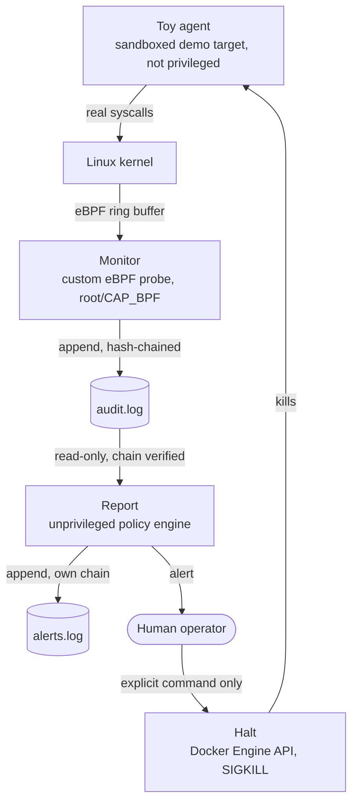

# Overseer

[](https://github.com/Davidpotters/overseer/actions/workflows/ci.yml)

A control-plane component that watches an AI system from outside it. Not
an agent itself -- it has one job: notice when a system under watch is
doing something it shouldn't, tell a human, and be able to stop it. It
never acts on its own judgment; a human decides whether to pull the
trigger.

**Status: v0 through v4 done and verified live, not just written.** See
the roadmap below for exactly what "verified" means for each one.

## The three verbs

- **Monitor** -- capture what the watched system is actually doing, at a
  layer it can't reach or falsify. A system's own self-reported logs
  aren't trustworthy evidence about itself, so this project observes
  from the kernel side (a custom eBPF probe) instead of trusting
  anything the target claims about its own behavior.
- **Report** -- turn raw observation into a signal worth a human's
  attention. The hard part isn't detecting a violation, it's not crying
  wolf: an alert nobody trusts at 2am is decoration, not security.
- **Halt** -- stop the target for real: kill the process, and prove it
  actually stayed dead. Triggered only by an explicit human command. If
  this project ever halted something on its own judgment, it would have
  become the thing it's supposed to watch.

## Why eBPF, and why not just Falco

Falco -- the CNCF-standard tool for exactly this -- was tried first, and
tested live in this project's own dev environment before being ruled
out. Its eBPF driver genuinely captures kernel syscalls here (confirmed
via its own internal metrics: ~230,000 events in 30 seconds, zero
drops), but its rule-matching engine never fired -- not on default
rules, not on hand-written rules copied verbatim from Falco's own
macros, even after fixing two real candidate causes along the way.
Building a small, purpose-written eBPF probe instead turned out to be
the better fit anyway: this project watches a small, well-understood set
of signals from one target, not an unbounded, general-purpose ruleset
written for arbitrary hosts.

## Design philosophy

A few choices here are deliberate, not the easiest path available:

- **A hand-written eBPF program, not a wrapped library.** Monitor's
  `bpf/execwatch.c` attaches to `syscalls:sys_enter_execve` using a
  struct layout confirmed directly against the running kernel's own
  tracepoint format, not copied from documentation that might not match.
- **Two independent hash-chained logs, not one shared one.** Report
  writes its own alert log rather than appending into Monitor's --
  two independent processes maintaining one hash chain in memory would
  silently race and corrupt it the moment they interleaved. Found while
  designing it, not after shipping it.
- **SIGKILL, not a graceful stop.** Halt calls the Docker Engine API's
  kill endpoint directly. A graceful stop sends SIGTERM, which a
  process can install a handler for and ignore -- tested and confirmed
  live (see the Phase 4 adversarial test below) before deciding this
  mattered enough to hard-code.
- **Report cannot call Halt.** There is no import, no shared function,
  no code path from the policy engine to the kill switch at all -- the
  separation a human decision requires isn't a convention here, it's
  the absence of a wire to cross.

## Architecture



## Roadmap

- [x] **v0 -- Monitor.** A custom eBPF tracepoint probe on
  `syscalls:sys_enter_execve`, verified against colima's real kernel:
  system-wide capture showed genuine host activity (kindnetd,
  containerd, dockerd) at real volume, correctly hash-chained; scoped to
  one container's cgroup, it showed *only* that container's activity,
  zero noise from the rest of a busy VM.
- [x] **v1 -- Report.** A policy engine tuned against real, measured
  alert-fatigue numbers, the same empirical discipline as Darvis's
  retrieval threshold: a naive first pass produced 320 alerts for what
  was really two events a human would recognize (libc's PATH-search
  retries one logical exec attempt several times under one pid); tuned
  down to 3 -- one disallowed exec, the start of a burst, and the burst
  itself.
- [x] **v2 -- Halt.** A ~15-line direct client for the Docker Engine
  API's kill endpoint, deliberately not a graceful stop, deliberately
  not routed through Report.
- [x] **v3 -- CI.** GitHub Actions: CodeQL, gitleaks, then a
  build/scan/sign gate (Trivy, SBOM, cosign keyless signing) across all
  four images, same shape as this portfolio's other projects.
- [x] **v4 -- Adversarial test.** The toy agent's `MODE=evade`
  specifically tries to survive Halt: it catches and ignores SIGTERM
  (confirmed to run out an entire `docker stop` grace period before
  Docker's own timeout finished it), then double-forks a detached daemon
  child to try to outlive its parent. Both the main process and the
  detached daemon's real host-level PIDs were confirmed running via `ps`
  immediately before a real Halt, and confirmed completely gone via the
  same check immediately after.

## Security notes

- **The demo target is sandboxed independently of whether Overseer's own
  detection works.** No elevated privilege, a read-only root filesystem
  with one scratch directory, no network by default, and hard CPU/
  memory/process-count ceilings -- adversarially tested (a fork bomb
  stopped at exactly the configured limit, a write outside the scratch
  dir hit a real `Read-only file system` error, effective capabilities
  confirmed all-zero) before any code simulating bad behavior was
  written at all.
- **Monitor never trusts the target's own reporting.** Everything it
  records comes from the kernel side of a syscall the target made, not
  from anything the target's own code printed or claimed.
- **Report has no path to Halt.** Enforced by the absence of an import,
  not a runtime check that could have a bug in it.

## Tech stack

- **Monitor:** Go, [`cilium/ebpf`](https://github.com/cilium/ebpf) for
  loading and reading a hand-written C eBPF program (`clang -target
  bpf`), runs privileged (the one component in this repo that needs to).
- **Report, Halt:** Go, unprivileged, distroless runtime images.
- **Toy agent:** Python, adversarially sandboxed (see above).
- **CI:** GitHub Actions -- CodeQL, gitleaks, Trivy, Syft-based SBOM
  (`anchore/sbom-action`), cosign keyless signing.

## Setup

Each component builds and runs independently; there's no single
`docker-compose up` yet since Halt's whole reason for existing is to be
invoked deliberately, not started alongside everything else.

```bash
# Toy agent -- normal mode by default; MODE=misbehave or MODE=evade
# to exercise the other two demo paths.
./toy-agent/run.sh
./toy-agent/run.sh -e MODE=misbehave
./toy-agent/run.sh -e MODE=evade

# Monitor -- needs --privileged for its eBPF probe and debugfs/cgroupfs
# mounted; scope it to one running container with -cgroup-path.
docker build -f cmd/monitor/Dockerfile -t overseer/monitor .
docker run -d --privileged \
  -v /sys/kernel/debug:/sys/kernel/debug:rw \
  -v /sys/fs/cgroup:/sys/fs/cgroup:ro \
  -v overseer-logs:/var/log/overseer \
  overseer/monitor -cgroup-path /sys/fs/cgroup/docker/<container-id>

# Report -- unprivileged, reads Monitor's log, writes its own.
docker build -f cmd/report/Dockerfile -t overseer/report .
docker run -d -v overseer-logs:/var/log/overseer overseer/report

# Halt -- only ever run by hand, on purpose.
./cmd/halt/run.sh -target <container-id-or-name> -reason "..." -yes-really-halt
```

## License

[MIT](LICENSE)
